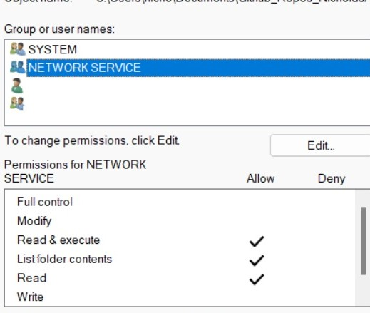

# Databases_Project

This is the github repo for 6th semester project in databases.

Please whenever you commit something make clear what you did by naming the commit in a clear way.

Remember that in order for you to see a change that another member has made you
have to pull the repo.

To set up the database:
1) Run the DDL_Script.sql in mysql.
2) Run the DML_SCRIPT.sql in mysql.
3) Install via pip (pip install mysql-connector-python == 8.0.28)
4) Give (.\Images) folder priviliges to NETOWRK SERVICE to use Image_Loading.py
Right click on folder Images -> properties.
(See below)

5) Set Variable secure-file-priv in my.ini (in %PROGRAMDATA% -> MySqlServer -> MySql<Version> -> my.ini) to "" for the Image_Loading Script to work.
6) Restart mysql Server (Stop Server -> Start Server)
7) Run python .\Image_Loading.py (To load the images for the recipes.)

Notes:
Recipes.json has dummy data for the recipes.
Chefs_dummy_data.json has dummy data for the chefs.
In Images folder lie all the imaIges used in the database.
Lab_stuff includes some queries from this semester's labs.Will be deleted before deadline.

Thank you.
